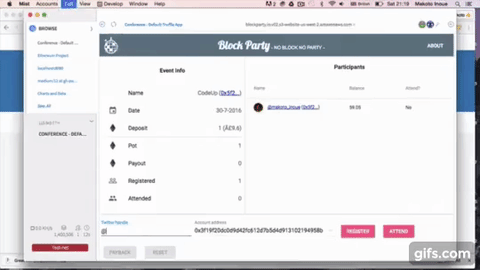

<h2>What is this?</h2>

  Have you ever encountered free party or meetup and realised that half the people registered did not actually turn up?
  BlockParty solves this problem by providing a simple incentive for people to register only if they mean it.

<h2>How does this work?</h2>

  Simple. You pay small deposit when you register. You lose your deposit if you do not turn up. You will get your deposit back + we split the deposit of whom did not turn up.
  You go to party and may end up getting more money.

  </img>

<h2> Demo </h2>

- [The demo site](http://blockparty.io.v02.s3-website-us-west-2.amazonaws.com/)
Real sites allows for participants to only `Register` and pay deposit to the site. Since this is a demo site, it allows you to `Register`, `Attend`, then press `Payback` button to simulate how it all works. Pressing `Reset` will reset the status so that you can play again.

- The last event on Mainnet is on http://bit.ly/blckprty.

<h2>How to setup</h2>

<h3>Option 1: access from Mist</h3>

This is the standard way of accessing Dapp

<ul>
  <li>Step 1: Install <a href='https://github.com/ethereum/mist/releases'>Mist browser (v 0.8 or higher)</a>, and make sure you choose <em style={{fontWeight:'bold'}}>mainnet</em>. Here is <a href='https://www.youtube.com/watch?v=Y3JfLgjqNU4'>a quick video tutorial</a> </li>
  <li>Step 2: Create an account on your wallet, and make sure you have at least 1.1 Ether.</li>
  <li>Step 3: Refresh the page </li>
</ul>

<h3>Option 2: access from browser and <a href='https://metamask.io/'>Metamask</a> Chrome extension</h3>

For those of you who have problem installing the Mist browser, or no time to download big blockchain, why don't you try out via this browser based extension

<ul>
  <li>Step 1: Install <a href='https://metamask.io/'>Metamask</a> Chrome extension </li>
  <li>Step 2: Create an account on your metamask, and make sure you have at least 1.1 Ether.</li>
  <li>Step 3: Refresh the page </li>
</ul>

<h3>Option 3: access from normal browser</h3>

This has been the standard way to access Dapp prior to Ethereum Wallet (lower than v 0.7)

<ul>
  <li>Step 1: Install <a href='https://github.com/ethereum/mist/releases'>Mist browser (v 0.8 or higher)</a>, and make sure you choose <em style={{fontWeight:'bold'}}>mainnet</em>. Here is <a href='https://www.youtube.com/watch?v=Y3JfLgjqNU4'>a quick video tutorial</a> </li>
  <li>Step 2: Create an account on your wallet, and make sure you have at least 1.1 Ether.</li>
  <li>Step 3: Stop Ethereum Wallet</li>
  <li>Step 4: Start geth(Go Etheruem, command line tool) with the following options. (See the <a href='https://github.com/ethereum/go-ethereum/wiki/Building-Ethereum'>installation instructions</a> for each platform)</li>
  <li>Step 5: Refresh this page </li>
</ul>
<blockquote style={{backgroundColor:'black', color:'white', padding:'1em'}}>
  geth --unlock 0 --rpc  --rpcapi "eth,net,web3" --rpccorsdomain '*'
</blockquote>

  NOTE:  --unlock 0 will unlock with one account.  --unlock 0 1 will unlock with two accounts.

<h2>How to play?</h2>
<ul>
  <li>Type your twitter account, pick one of your address, then press 'Register'. It will take 10 to 30 seconds to get verified and you will receive notification.</li>
</ul>

<h2>FAQ</h2>
<h3>Can I cancel my registration?</h3>

No

<h3>What happens if I do not withdraw my payout?</h3>

  If you do not withdraw your payout within one week after the event is end, the host (contract owner) will clear the balance from the contract and the remaining blance goes back to the host, so do not keep them hanging

<h3>What happens if the event is canceled?</h3>

  In case the event is canceled, all registered people can withdraw their deposit.
  Make sure that you register with correct twitter account so that the host can notify you.

<h3>What if there is a bug in the contract!</h3>

  If the bug is found before the contract is compromised, the host can kill the contract and all the deposit goes back to the host so he/she can manually return the deposit.
  If the contract is compromised and the deposit is stolen, or his/her private key is lost/stolen, I am afraid that the host cannot compensate for you. Please assess the risk before you participate the event.

<h3>Can I host my own event using BlockParty?</h3>

  Please contact the <a href="http://twitter.com/makoto_inoue">author of this project</a> if you are interested.

<h3>Do you take any commission?</h3>

  No, but if you like this project, it would be great if you can donate to my <a href="https://simplybusiness.everydayhero.com/uk/makoto">5 days Sahara trekking challenge page</a> mentioning "BlockParty". This will help Whizz-Kidz, disabled children's charity, which I am currently fund raising.

<h2>Terms and conditions</h2>

  By downloading and deploying this software, you agree to our terms and conditions of use. We accept no responsibility whether in contract, tort or otherwise for any loss or damage arising out of or in connection with your use of our software and recommend that you ensure your devices are protected by using appropriate virus protection.

## Hacking guide

### Prerequisite

- [geth](https://github.com/ethereum/go-ethereum/wiki/geth)
- [nodejs](https://nodejs.org/en/)
- [npm](https://www.npmjs.com/)
- [webpack](https://webpack.github.io/) = Make sure you install globally with `npm install webpack -g`
- [truffle](http://truffle.readthedocs.org) = version 2.0.4
- [testrpc](https://github.com/ethereumjs/testrpc)

### Installation

- Run `npm`

NOTE: If it installs extra zeppilin contracts, do not commit, but remove them.

### Running test

- Run `testrpc` in one console
- Run `truffle test`

### Running locally

- Run `testrpc` in one console
- Run `truffle migrate`
- Run `truffle serve`
- Open `http://localhost:8080`

## TODO

### Essentials

See [Issues](https://github.com/makoto/blockparty/issues)

### Wishlists

- Show who event owner is
- Upload the deployed source code to `etherscan.io`
- Add redux
- Add testing for frontend
- Change payback ratio (eg: first registered, more reward)
- Let user to register by sending Ether (so that they could potentially register not via wallet but via exchange, etc)
- Automatic check in
- Waitlist
- Transfer my spot
- Refresh info when someone else register/attend
