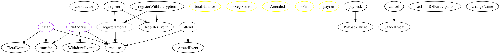

# BlockParty version 0.8.4 pre auditing guide.

This is a self-audit result of version [0.8.4](https://github.com/makoto/blockparty/releases/tag/v0.8.4).

- Chapter 1: About this contract
- Chapter 2: Past vulnerabilities.
- Chapter 3: Static analysis
- Chapter 4: Manual analysis

## Disclaimer

This self-audit is very subjective so please do not fully rely on the result of this report to assess the safety of the contract. The intention of this report is to give enough context to other smart contract developers so that they can look into the source code on their own critical eyes. If you find any critical vulnerabilities, please raise [a new issue](https://github.com/makoto/blockparty/issues/new) tagging `security` and `bug`.

## Chapter 1: About this contract

BlockParty is an event management smart contract. You pay a small deposit when you register. You lose your deposit if you do not turn up. You will get your deposit back + we split the deposit of whom did not turn up.

### Contract structures and function names

```
$ surya describe  contracts/Conference.sol 
 +  Conference (Destructible, GroupAdmin)
    - [Pub] <fallback> 
    - [Ext] registerWithEncryption ($)
    - [Ext] register ($)
    - [Int] registerInternal 
    - [Ext] withdraw 
    - [Pub] totalBalance 
    - [Pub] isRegistered 
    - [Pub] isAttended 
    - [Pub] isPaid 
    - [Pub] payout 
    - [Ext] payback 
    - [Ext] cancel 
    - [Ext] clear 
    - [Ext] setLimitOfParticipants 
    - [Ext] changeName 
    - [Ext] attend 

$ surya describe  contracts/GroupAdmin.sol 
 +  GroupAdmin (Ownable)
    - [Pub] grant 
    - [Pub] revoke 
    - [Pub] getAdmins 
    - [Pub] numOfAdmins 
    - [Pub] isAdmin 
```

And this is the dependency graph



### The flow of the contract.

The smart contract is a very simple contract similar to any crowdsale and flows in the following order.

```
deploy => register(WithEncryption) => attend => payback => withdraw => clear
```

- The main contract is called `Conference.sol` which inherits from `Distructible`, `Ownnable` and `GroupAdmin`.
- The `Conference` contract is configurable at deployment time to set event `name`, `number of participants`, `cooling period` and `deposit amount`.
- If a public key is given at the deployment type, it enables the user to input their full name which is encrypted with the public key.
- The event name is configurable until users start registering.
- The contract owner (= event owner) can increase/decrease the number of participants until the event ends.
- When the user registers, users are expected to provide the twitter handle.
- If an encrypted full name of the participant is passed at `registerWithEncryption` it is stored in the event log, which the owner of the private key can decrypt using `script/decrypt_fullname.js`.
- The participants can register even during check-in is in place. If the contract owner wants to prevent people from registering, the contract owner should call `setLimitOfParticipants` to lower the number of participants so that no more users can register.
- The check-in is done by either the event owner or admins. The event owner can grant/revoke admin rights.
- The event ends when the contract owner either call `payback` or `cancel` function.
- When the `payback` is called, it calculates the `payout` amount which attendees can `withdraw`.
- In the case of `cancel` all participants who registered the event can withdraw his/her.
- The attendees should be withdrawing their payout within the cooling period (the default is one week). After the cooling period, the owner can call `clear` function to transfer any remaining balance from the contract to the owner address.

### Some decision behind the architectural choice.

#### Deploying each contract per event.

A new contract needs to be deployed for each event, which incurs some cost at each deploy.
This makes it relatively expensive to use for a small number of participant especially when the gas price or Ether price is expensive. However, this will allow us to constantly update and refactor the contract to be up to date without having complex upgradability strategy.

#### No strict time dependencies.

The current contract does not contain any information about the event start and ends time as real events often do not have strict deadlines on participation. Also, the current unstable nature of Ethereum mainnet occasionally make it difficult (or too expensive) to interact with the contract in a timely manner so it often comes down to the event owner to decide when it ends the event. The only exception is `cooling period` which last for a week by default. Having the cooling period is mainly to encourage users to withdraw deposits as soon as possible so that users can avoid possible loss of funds if any bugs or vulnerabilities are found (or the deployment account is compromised). Please refer to [this blog post](https://medium.com/@makoto_inoue/running-everyday-dapp-when-ethereum-is-under-pressure-2c5bf4412c13) for the user impact when Ethereum network is under performance pressure.

#### Pull over Push

The users need to interact with the smart contract twice, at registration and at withdrawal. The need to manually withdraw fund is an inconvenience to the users but this is to avoid the potential reentrancy attack. Please refer to [this blog post](https://medium.com/@makoto_inoue/a-smartcontract-best-practice-push-pull-or-give-b2e8428e032a) for how this decision was made.

## History of vulnerabilities

BlockParty has encountered multiple bugs though nothing has been exploited yet with the exception of [the author's deployment account being compromised](https://medium.com/@makoto_inoue/a-postmortem-on-the-blockparty-deployment-account-security-issue-35ad52d7f911) leading to a loss of ETH 1. To see the full detail of past security issues, please refer to the [github issues](https://github.com/makoto/blockparty/issues?utf8=%E2%9C%93&q=is%3Aissue+label%3Asecurity++label%3Abug).

The three major vulnerabilities are described in this chapter.

- 1. Party Crasher
- 2. Reentrancy
- 3. Cancel and gone

### [Party crasher](https://github.com/makoto/blockparty/issues/23)

- Summary: any user can change the limit of participants
- Cause: Forgot to put `ownerOnly` on `setLimitOfParticipants` function
- When: 2016 Sep
- How it was found?: Makoto found it while showing the code to [Manuel Araoz](https://twitter.com/maraoz) at a security meetup during DevCon2.

### [Reentrancy bug](https://github.com/makoto/blockparty/issues/45)

- Summary: a malicious contract can re-enter
- Cause: Changing a state after transferring funds
- When: 2017 Feb
- How it was found?:  [Daniele Carmelitti](https://github.com/danielitti) spotted while Makoto was showing the code at CodeUp.

### [Cancel and gone](https://github.com/makoto/blockparty/issues/81)

- Summary: Anyone can withdraw if the event is canceled
- Cause: Invalid condition after refactoring
- When: 2017 Sep
- How it was found?:  [Will Harborne](https://twitter.com/will_harborne) raised the vulnerability issue after chatting with Makoto at a pub.

## Static analysis

### Prior to the auditing.

I followed the excellent guide of Trail of bits [How to prepare for a security audit](https://blog.trailofbits.com/2018/04/06/how-to-prepare-for-a-security-audit/).

The followings are the quick checklist.

- Enable and address compiler warnings => All solium errors and warnings are fixed
- Increase unit and feature test coverage => Current coverage is 98%
- Remove dead code, stale branches, unused libraries, and other extraneous weight. => Deleted most dead branches.

### Static analysis using off the shelf tools and services.

- Securify.ch = No error was reported.
- SmartCheck  = No error was reported. The full report is [here](https://tool.smartdec.net/scan/a51c4105dd0548d98495da1bac37dffa).
- Oyente = The latest solc supported version is 0.4.17 hence could not test.
- [mythril](https://github.com/ConsenSys/mythril) = The current version (0.18.6) seems to support only sol 0.4.23. Temporarily downgraded to the `0.4.23` and tried it manually. The full log is [here](https://gist.github.com/makoto/62542bafe6e4e19bdee7070acf56a1f0). There are a lot of duplicate errors against undecrypted functions (eg: `_function_0x05f203d9`) which make it hard to point to the exact location of the vulnerabilities. The followings are the notable warnings.

```
==== Integer Overflow  ====
Type: Warning
Contract: Unknown
Function name: changeName(string)
PC address: 9318
A possible integer overflow exists in the function `changeName(string)`.
--
==== Transaction order dependence ====
Type: Warning
Contract: Unknown
Function name: withdraw()
PC address: 5265
A possible transaction order independence vulnerability exists in function withdraw(). The value or direction of the call statement is determined from a tainted storage location

--------------------
In file: contracts/Conference.sol:142

participant.addr.transfer(payoutAmount)
--
==== Dependence on predictable environment variable ====
Type: Warning
Contract: Unknown
Function name: clear()
PC address: 5637
In the function `clear()` the following predictable state variables are used to determine Ether recipient:
- block.timestamp

--------------------
In file: contracts/Conference.sol:220

owner.transfer(leftOver)
```

Both `changeName` and `clear` can be only called by admins so less of the issue. Currently contacting mythril team what is the meaning for `Transaction order dependence` warning.

## Manual audit results.

It is very difficult to audit my own code as I have seen it many many times. I could not find any obvious flows but there are more than a few inefficient codes and some logical flaws

### Conference.sol

- line 7: `string public name;` can be bytes32 to save storage cost (or no need to store within the contract). Even though this is not necessary, it is convenient to be able to inspect the contract name from something like Etherscan so left as is.
- line 20: Ues of `participantsIndex` to access to each participant increases the number of calls. There is [a stale PR](https://github.com/makoto/blockparty/pull/95) which can fix the issue.
- line 26: Marking each participant at `bool attended;` is not performant and can cost lots of gas if the number of participants is big. This is tracked at [github issue](https://github.com/makoto/blockparty/issues/160)
- line 103: It allows people to register without an encrypted full name. It is a non-issue as event owner can reject people who did not provide the full name.

### zeppelin/ownership/Ownable.sol

- line 38: The owner can be transferred into wrong address or empty address by mistake = Tracked [here](https://github.com/makoto/blockparty/issues/162)


### Potential Logical flaws

#### Twitter account can be faked

The twitter field is just a plain text so anyone can put fake id. This is usually not the case as event owner can simply reject the user if they put fake twitter account. The strict KYC can be deployed off-chain, not necessary to be done on-chain.

#### Event owner could maliciously block participants to join by controlling limitOfParticipants

This is a feature to close the event registration.

#### Event owner can cheat.

Currently, a contract owner has strong power to mark who attended and who did not attend. It is possible for event owners not to mark certain users who he/she does not like. For this reason, the creation of event is currently not open to everyone (unless someone downloads the project from GitHub and deploys on their own [which has been done in the past](https://blockparty.polynom.com/) but with the help of the author). 

#### Participants may try to deceive other participants to increase the payout

It is possible though earning small extra payout does not give enough motivation to do so as long as the deposit is not significant.